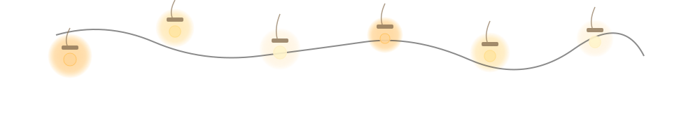
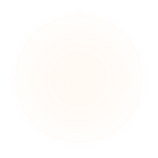

<!-- Hanging lights decoration -->

  

<!-- Two-column hero -->
<table style="width:100%;border-collapse:collapse;margin:0 0 32px 0">
  <tr>
    <td style="width:65%;padding:0 32px 0 0;vertical-align:middle">
      <!-- Hero content (left) -->
      <h1 style="margin:0 0 8px 0;font-size:52px;font-weight:700;line-height:1.1;color:#000">Akshat Thakur</h1>
      
Software Developer

      
Curious by default. Practical by design.

      
      <!-- Primary CTA + secondary links -->
      

        
        

          <a href="https://www.linkedin.com/in/akshatthakur22/" style="color:#0071E3;text-decoration:none">LinkedIn</a>
          ·
          <a href="https://github.com/Akshatthakur22" style="color:#0071E3;text-decoration:none">GitHub</a>
          ·
          <a href="mailto:akshatthakur22@gmail.com" style="color:#0071E3;text-decoration:none">Email</a>
        

      

    </td>
    <td style="width:35%;padding:0;vertical-align:middle;text-align:right">
      <!-- Portrait (right) with warm background -->
      

        
        
      

    </td>
  </tr>
</table>

<!-- About section -->

I build software by turning real-world problems into useful products. I learn by building: trying things, breaking them, and figuring out how the pieces fit together.

<!-- What I care about section heading -->
<h2 style="margin:0 0 16px 0;font-size:18px;font-weight:600;color:#000">What I care about</h2>

<!-- Three-column grid: philosophy values (using table for GitHub compatibility) -->
<table style="width:100%;border-collapse:collapse;margin:0 0 16px 0">
  <tr>
    <td style="width:33.33%;padding:16px;background:#f9f9f9;border-radius:12px;border:1px solid #efefef;margin-right:16px">
      

        
        

          
Simplicity

          
Fewer moving parts, fewer ways to fail.

        

      

    </td>
    <td style="width:33.33%;padding:16px;background:#f9f9f9;border-radius:12px;border:1px solid #efefef;margin:0 8px">
      

        
        

          
Craftsmanship

          
The details nobody notices are worth getting right.

        

      

    </td>
    <td style="width:33.33%;padding:16px;background:#f9f9f9;border-radius:12px;border:1px solid #efefef;margin-left:16px">
      

        
        

          
Product thinking

          
Start with the person and the problem, not the stack.

        

      

    </td>
  </tr>
</table>

<!-- Two-column grid: systems + human-first -->
<table style="width:100%;border-collapse:collapse;margin:0 0 32px 0">
  <tr>
    <td style="width:50%;padding:16px;background:#f9f9f9;border-radius:12px;border:1px solid #efefef;margin-right:8px">
      

        
        

          
Systems

          
I want to know how it works, and what happens when it breaks.

        

      

    </td>
    <td style="width:50%;padding:16px;background:#f9f9f9;border-radius:12px;border:1px solid #efefef;margin-left:8px">
      

        
        

          
Human-first

          
Software should adapt to people, not the other way around.

        

      

    </td>
  </tr>
</table>

<!-- Beyond code section -->
<h2 style="margin:0 0 16px 0;font-size:18px;font-weight:600;color:#000">Beyond code</h2>
<table style="width:100%;border-collapse:collapse;margin:0 0 32px 0">
  <tr>
    <td style="width:50%;padding:16px;background:#fafaf9;border-radius:12px;border:1px solid #f0f0f0;margin-right:8px">
      

        
        

          
Community

          

            <b>Google</b> Student Ambassador · <b>GFG Student Chapter</b> Technical Head · <b>ICSEE 2024</b> Presenter
          

        

      

    </td>
    <td style="width:50%;padding:16px;background:#fafaf9;border-radius:12px;border:1px solid #f0f0f0;margin-left:8px">
      

        
        

          
Tools

          

            Python · TypeScript · JavaScript · React · Next.js · Node.js · PostgreSQL · MongoDB · Rust · Docker
          

        

      

    </td>
  </tr>
</table>

<!-- Signature statement -->

Understand the problem. 
Build the simplest thing that works. 
Then keep it working.

