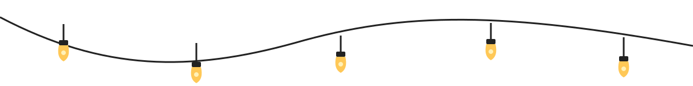

<!-- HERO -->

  

<picture>
  <source
    media="(prefers-color-scheme: dark)"
    srcset="./name-dark.svg"
  >
  
</picture>
 
<strong>Software Developer</strong>
 
Curious by default. Practical by design.
  
 
 
<a href="https://www.linkedin.com/in/akshatthakur22/">LinkedIn</a>
&nbsp;·&nbsp;
<a href="https://github.com/Akshatthakur22">GitHub</a>
&nbsp;·&nbsp;
<a href="mailto:akshatthakur22@gmail.com">Email</a>

 
 

  I build software by turning real-world problems into useful products.
  I learn by building: trying things, breaking them, and figuring out how the pieces fit together.

<table style="width:100%;border-collapse:collapse;margin:0 0 24px 0">
  <tr>
    <td style="width:33.33%;padding:12px;border:1px solid #e5e5e5;vertical-align:top;background:#fafbfc">
      

        
        

Simplicity

Fewer moving parts, fewer ways to fail.

      

    </td>
    <td style="width:33.33%;padding:12px;border:1px solid #e5e5e5;vertical-align:top;background:#fafbfc">
      

        
        

Craftsmanship

The details nobody notices are worth getting right.

      

    </td>
    <td style="width:33.33%;padding:12px;border:1px solid #e5e5e5;vertical-align:top;background:#fafbfc">
      

        
        

Product thinking

Start with the person and the problem, not the stack.

      

    </td>
  </tr>
  <tr>
    <td colspan="2" style="padding:12px;border:1px solid #e5e5e5;vertical-align:top;background:#fafbfc">
      

        
        

Systems

I want to know how it works, and what happens when it breaks.

      

    </td>
    <td style="padding:12px;border:1px solid #e5e5e5;vertical-align:top;background:#fafbfc">
      

        
        

Human-first

Software should adapt to people, not the other way around.

      

    </td>
  </tr>
  <tr>
    <td colspan="2" style="padding:12px;border:1px solid #f0f0f0;vertical-align:top;background:#fafbfc">
      

        
        

Beyond code

<b>Google</b> Student Ambassador · <b>GFG Student Chapter</b> Technical Head · <b>ICSEE 2024</b> Presenter

      

    </td>
    <td style="padding:12px;border:1px solid #f0f0f0;vertical-align:top;background:#fafbfc">
      

        
        

Tools

Python · TypeScript · JavaScript · React · Next.js · Node.js · PostgreSQL · MongoDB · Rust · Docker

      

    </td>
  </tr>
</table>

Understand the problem. Build the simplest thing that works. Then keep it working.

